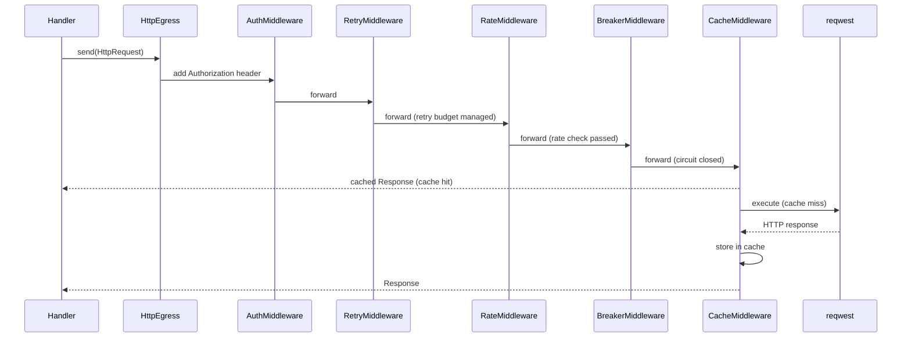
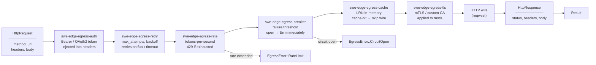

# Architecture — edge-egress-http

Eight independent middleware crates compose into a `reqwest-middleware` chain: `auth → retry → rate → breaker → cache → cassette → tls`. Each is opt-in; policy lives in TOML.

---

## Sequence

> A domain handler sends an outbound HTTP call through the middleware stack; each layer can short-circuit or mutate before the wire call.

## Data Flow

> An `HttpRequest` flows left-to-right through the middleware chain; each layer may terminate early or pass through; the final response flows back.

